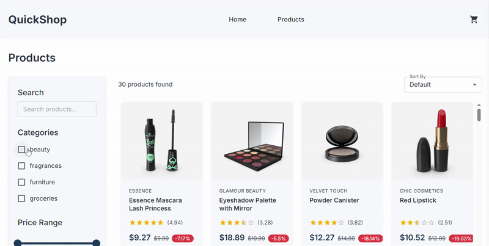

# 🛒 QuickShop

**QuickShop** is a modern, responsive eCommerce web application built with React and Material UI. It provides a seamless shopping experience with optimized performance, clean architecture, and comprehensive test coverage.

---

## Features

- Full eCommerce experience with product listing, cart, and checkout
- Built with [React](https://reactjs.org/) and [React Router](https://reactrouter.com/) for SPA navigation
- UI powered by [Material UI (MUI)](https://mui.com/) for consistent, responsive design
- Global state management using React Context API
- Performance optimizations including:
  - Lazy loading of components
  - Code splitting using dynamic `import()`
  - Memoization with `React.memo`, `useMemo`, and `useCallback`
- Unit and integration tests using [Jest](https://jestjs.io/) and [React Testing Library](https://testing-library.com/)

---
## Screenshots

<p align="center">
  
  
  
  
</p>

## Demo

<p align="center">
  
</p>
---

## Tech Stack

| Category       | Technology                          |
|----------------|--------------------------------------|
| Frontend       | React, React Router, JavaScript      |
| UI Framework   | Material UI                          |
| State          | React Context API                    |
| Testing        | Jest, React Testing Library          |
| Optimization   | Lazy loading, Code splitting, Memoization |

---

## Project Structure

```bash
quick-shop/
├── assets/
├── public/
├── src/
│   ├── api/
│   ├── components/
│   ├── context/
│   ├── pages/
├── package.json
├── README.md
└── ...
